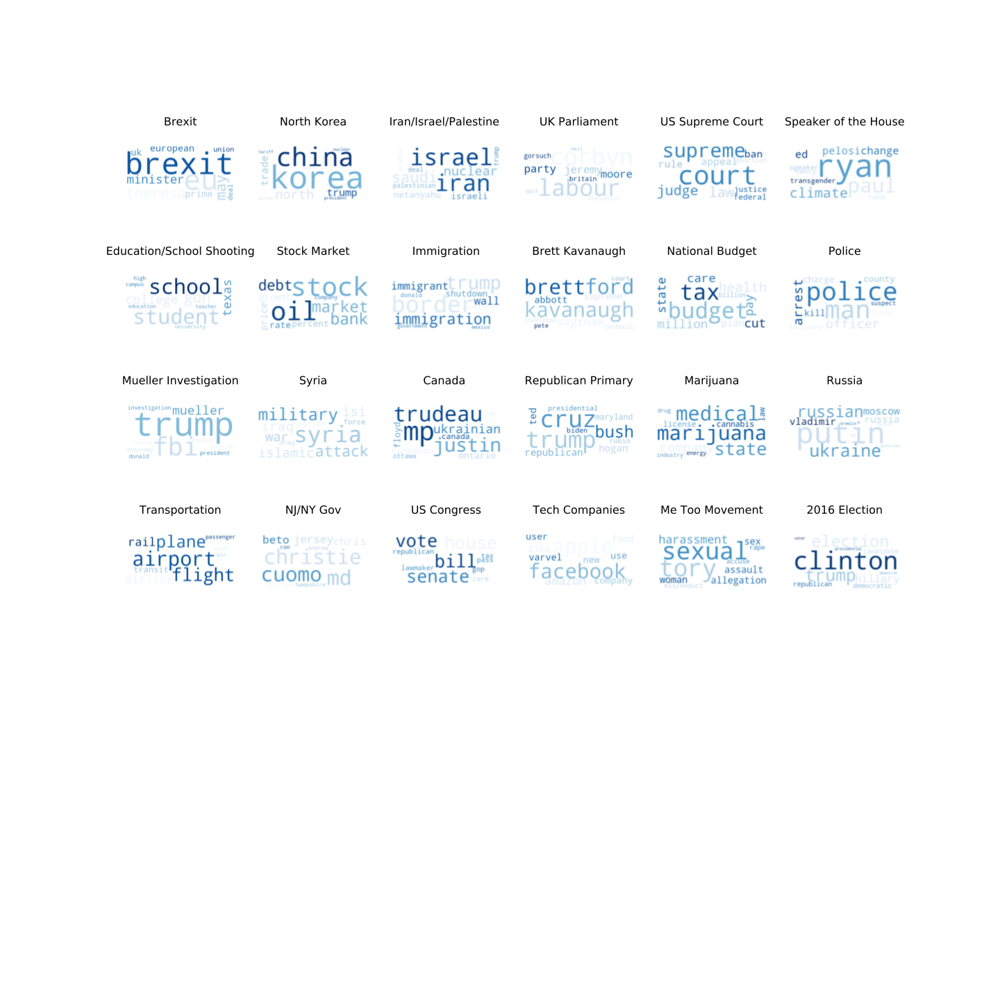

# Project Proposal: Surveying the Political Landscape through Political Corpora

In the modern information age, it is imperative to consider the integrity and potential biases of ones source.
This is especially important with the on-going proliferation of "fake news" and usage of media to further agendas as opposed to inform.
Are there certain journalists or news outlets that fixate on particular issues and/or present these issues with biased slants?
The goal of this project is to inform readers not only of the existence of these potential hidden agendas (with evidence) but also to inform them how these agendas fit in the larger political landscape.

Thus the goal of this project is two-fold:
1) To provide users with a readily accessible summary of the current political landscape.
2) To show users how different journalists and media outlets fit into this landscape while highlighting potential biases.

Note: that this is the second iteration of the proposal, the first iteration can be found in round1\_proposal.

# The Model

For this project, I would scrape data from Muck Rack and Google News. Muck Rack is a media database that operates much like a Facebook for journalists and public relations representatives while Google News is a news aggregator. The strength of the Muck Rack database is that it already organizes articles by user so that a given journalist's political corpus can readily be accessed. Google News on the other hand is more suitable for collecting recent news.

In order to build the model, I would use a combination of topic modeling (e.g. latent Dirichlet allocation) and sentiment analysis to construct a representation of the current political landscape. 

I imagine presenting users with a scatter plot of topics e.g. Trump, immigration, gun-control, etc whose representative points are scaled in size so as to represent the volume of articles on a given topic. Clicking on a topic would yield another scatterplot with each point corresponding to an author and colored according to potential political bias, as determined by the sentiment analysis with point size given by the number of articles by that author on the topic. Hovering over one of these points would yield a link to the article and information on the author. One could also click on an author or media source to see a similar presentation restricted to that source's political corpus. This type of data analysis could be particularly impactful if implemented as a google chrome plug-in that automatically offers such information on the author whenever a news article is visited.

# Exploratory Data Analysis

As a first step, I scraped the most recent 10,000 unique article titles and headlines with associated article links and source names from all users on https://muckrack.com/. This totaled to around 5 GB of data corresponding to around 12,000 authors and 7 millions articles. Code for scraping can be found in the scrape folder.
I then gauged the appropriateness of this dataset for my desired application by looking at site usage statistics. Since I was unfamiliar with the site prior to this project, I needed to verify that the user database and number of articles per user was large enough to be useful. This was confirmed and discussed in detail in the initial proposal. 

The scraped text data was then scrubbed via tokenization, stop word/punctuation removal and lemmatization. In order to build a representation of the associated political landscape, a combination of unsupervised and supervised approaches have been used. In order to have an unbiased initial look at the data, I first used latent Dirichlet allocation (LDA), the archetypal topic modeling algorithm.  LDA was highly successful and able to identify several important topics e.g. Brexit, immigration, the Mueller investigation, marijuana legalization, and others. A larger list of notable topics can be found in the word clouds below and in my opinion constitutes a very accurate summary of the current US political landscape. Code for the above LDA can be found in the LDA folder.

However, as a clustering algorithm, LDA is limited in it's classification abilities and little control can be exerted over the results e.g. it is unable to pick out user-specified topics. One might hope to alleviate this by heavily influencing the underlying prior over words for each topic but this yielded poor performance in practice so we opt to supplement it with a secondary, discriminative approach based on seeded word-frequency analysis. Several topics were chosen by me based on the top voting issues of previous elections e.g. gun control, immigration, the national budge, etc. I then specified words and phrases that would nearly guarantee correct classification. For example headlines with "gun policy" in them certainly deal with gun policy. This topic seeding was done in a two-level fashion by providing a list of phrases that would automatically assign a topic and another list that would assign a topic if the number of instances exceeded a threshold. Although no ground truth exists for our dataset, a random sampling of classified articles shows that this procedure works extremely well. Having obtained a subset of our data for which we are highly confident in its classification, we can use this subset as train data for a more powerful classifier such as an SVM that isn't limited to picking out certain phrases. This is to be done in future work. Code for this work can be found in the topic\_assist folder. Futhermore, some front-end development has been done [here](https://jvend.github.io/political_landscape_survey/) to produce an interactive plot of the political landscape implemented in d3.js. At the moment this plot only shows the topics for the above approach and their associated article counts but in the future will contain the functionality described in the model.

Having already obtained a first order topic model and classification scheme, we can now ask if any articles/authors within a particular topic exhibit strong sentiment towards said topic. By thresholding for strong positive and negative headline sentiment, we can pick successfully pick out articles with titles like "Why Trump deserves a Nobel Prize" and negative ones like "Donald Trump Can Go to Hell and If You Defend This, So Can You".  However, a naive application of sentiment analysis also picks out articles such as "A Divided Syria Reacts Wearily to Airstrikes From U.S. and Allies" which contains the phrase "President Donald Trump said the recent suspected chemical attack in Syria was the crime of a monster". Unsurprisingly a naive application of sentiment analysis is subject to mistakes. Nevertheless this can be largely alleviated by the use of parse trees to detect subject object relations to ensure that only sentiment corresponding to a particular subject is captured. This is to be done in future work but even this preliminary sentiment analysis reinforces the picture that authors can be heavily biased and suggests that profiling authors for bias is a meaningful goal.

The preliminary work above already provides interesting insight into the political landscape and the existence of author bias in polical media. It suggests that this project is certainly viable and is something I would be excited to pursue this summer.

Notable topics from the LDA clustering can be found below. Note that topic labels have been provided by me.

