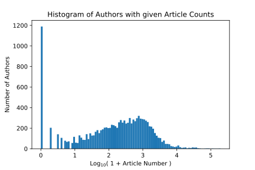
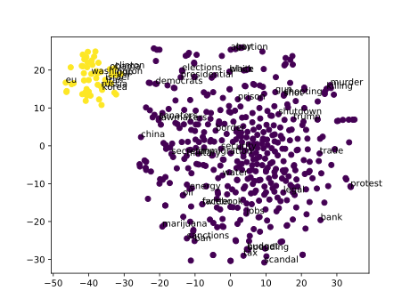

# Project Proposal: Surveying the Political Landscape through Political Corpora

In the modern information age, it is imperative to consider the integrity and potential biases of ones source.
This is especially important with the on-going proliferation of "fake news" and usage of media to further agendas as opposed to inform.
Are there certain journalists or news outlets that fixate on particular issues and/or present these issues with biased slants?
The goal of this project is to inform readers not only of the existence of these potential hidden agendas (with evidence) but also to inform them how these agendas fit in the larger political landscape.

Thus the goal of this project is two-fold:
1) To present users with a neatly arranged and readily accessible summary of the current political landscape that evolves with time.
2) To show users how different journalists and media outlets fit into this landscape and inform them of potential biases.

# The Model

For this project, I would scrape data from Muck Rack and Google News. Muck Rack is a media database that operates much like a Facebook for journalists and public relations representatives while Google News is a news aggregator. The strength of the Muck Rack database is that it already organizes articles by user so that a given journalist's political corpus can readily be accessed. Google News on the other hand is more suitable for collecting recent news.

In order to build the model, I would use a combination of topic modeling (e.g. latent Dirichlet allocation) and sentiment analysis to construct a representation of the current political landscape. This sentiment analysis can be facilitated by first learning a set of controversial topics (e.g. gun control, religious freedom, drug laws, marriage rights, immigration, privacy rights etc.) and associated vocabulary by analyzing a corpus of opinion pieces and then emphasizing the sentiment towards these topics in the political text data.  I imagine presenting users with a scatter plot of topics e.g. Trump, immigration, gun-control, etc whose representative points are scaled in size so as to represent the volume of articles on a given topic. These topics points would make use of word embedding methods e.g. word2vec and a dimensionality reduction method e.g. t-SNE or UMAP so that similar topics are related by proximity and readily visualized. Clicking on a topic would yield another scatterplot with each point corresponding to an article and colored according to potential political bias, as determined by the sentiment analysis. Again these points would make use of a word/document embedding method e.g. word2vec or doc2vec and dimensionality reduction method. Hovering over one of these points would yield a link to the article and information on the author. One could also click on an author or media source to see a similar presentation restricted to that source's political corpus.

# Exploratory Data Analysis

As a first step, I scraped the most recent 10,000 article titles, headlines, and links to associated articles from all users on https://muckrack.com/. This totaled to around 10 GB of data. Code for scraping can be found in the scrape folder.
I then gauged the appropriateness of this dataset for my desired application by quantifying site usage tendencies. Since I was unfamiliar with the site prior to this project, I needed to confirm that the user database and number of articles per user was large enough to be useful. To this end I constructed a histogram of the number of authors with a given article count, see below. 

Note that the x-axis of the histogram utilizes a logarithmic transformation over article number. This allows us to properly visualize the entire user statistics in the same plot as well as see deviation from exponential decay of the number of author numbers per article count. For this dataset, we can see a central "hump" in the histogram after an initial decay. This hump says that the squeezing from our logarithmic scale outpaces the decay rate of the underlying distribution. Ultimately, we can say that underlying distribution is heavy-tailed and the number of prolific authors is high. I've included code for these results in the histogram folder.

The scraped text data was then scrubbed via tokenization and stop word/punctuation removal. In order to build a representation of the political landscape, I performed a word-frequency analysis of title words for all scraped articles. The 1,000 most frequently used words were embedded in a 300-dimensional vector space using word2vec pretrained with Google News data (GoogleNews-vectors-negative300.bin). This embedding was then projected into 2-dimensions using t-SNE and clustered using a Gaussian mixture model. These points are plotted in the scatter plot below. I hand-picked ~50 labels that I thought were interesting to display since displaying everything at once results in an illegible plot and colored the points by cluster.

The aforementioned process already provides interesting insight into the political landscape. Two clusters are clearly present in the data. Examining the words constituting these clusters we see that the larger purple cluster contains words related to important social issues of interest to the general public e.g. "immigration", "marijuana", "water", "shooting", "abortion", "gay", etc while the smaller yellow cluster contains language that is highly political or focused on international relations e.g. "gop", "washington", "israel", "iran", "eu", "clinton", "russia", "korea", "obama", etc. Interestingly enough, Trump and Clinton belong to different clusters possibly due to Clinton's role in foreign policy and Trumps active presence in the social commentary of the country. Nonetheless, the above exploratory analysis suggests that this project is certainly viable. Code for these results can be found the the topic-embedding folder
